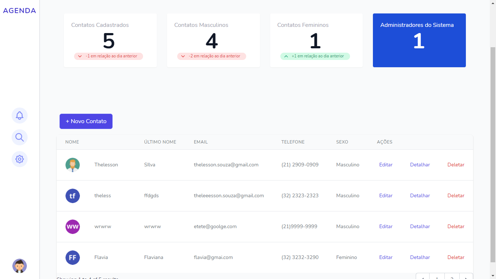
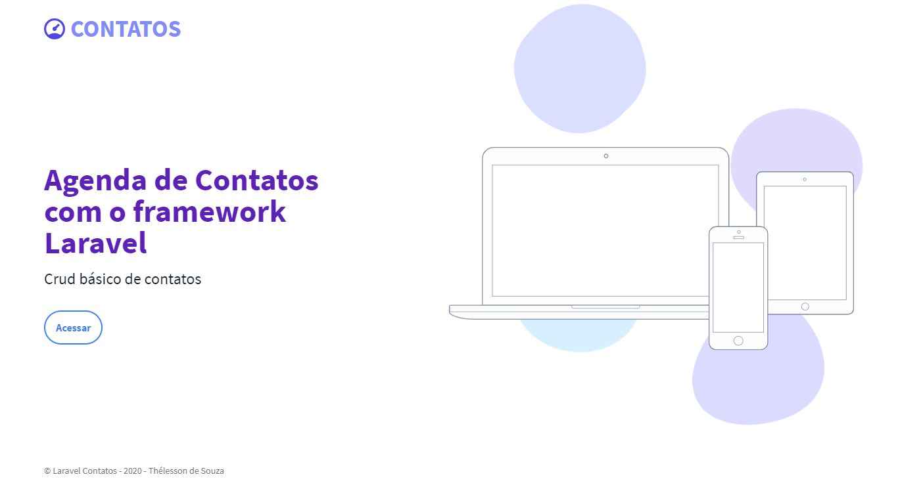
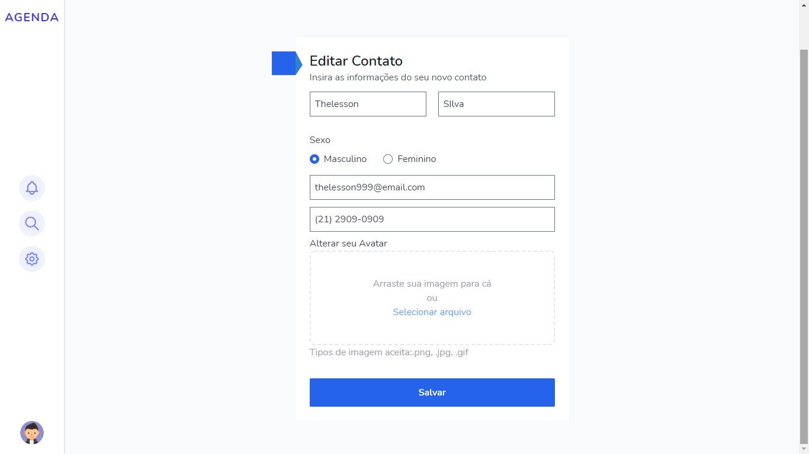
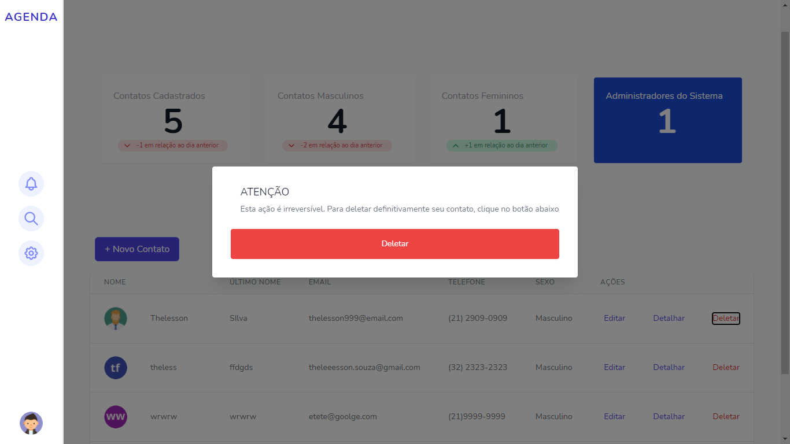
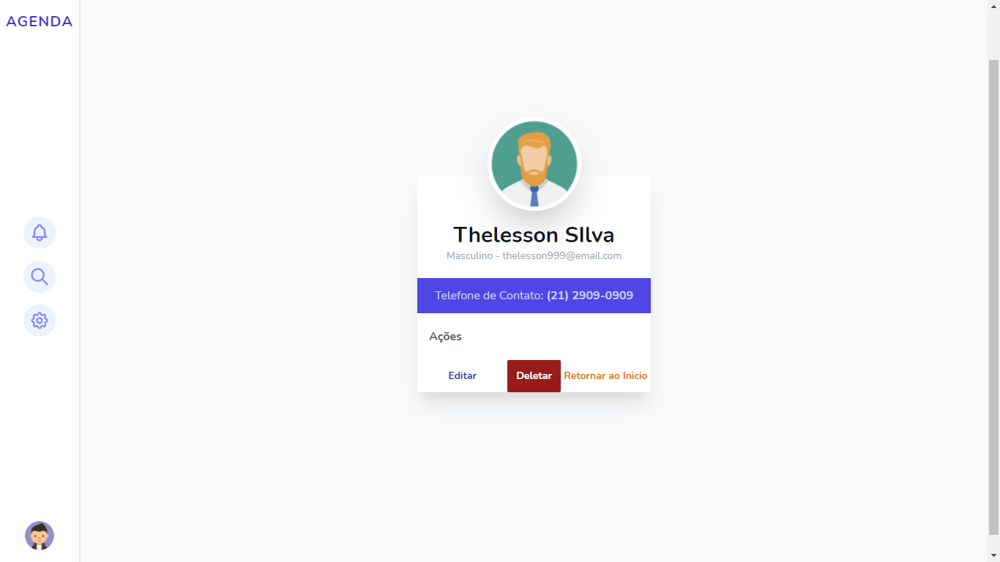
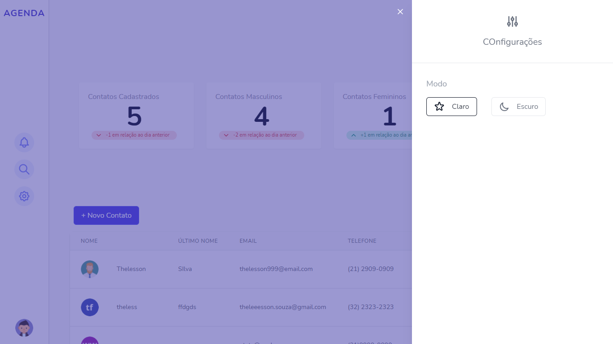
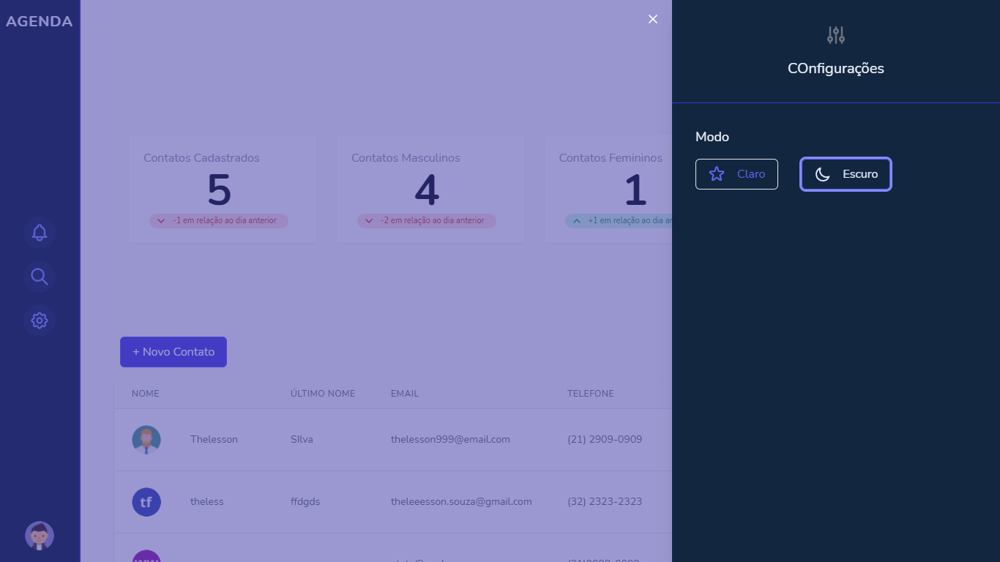
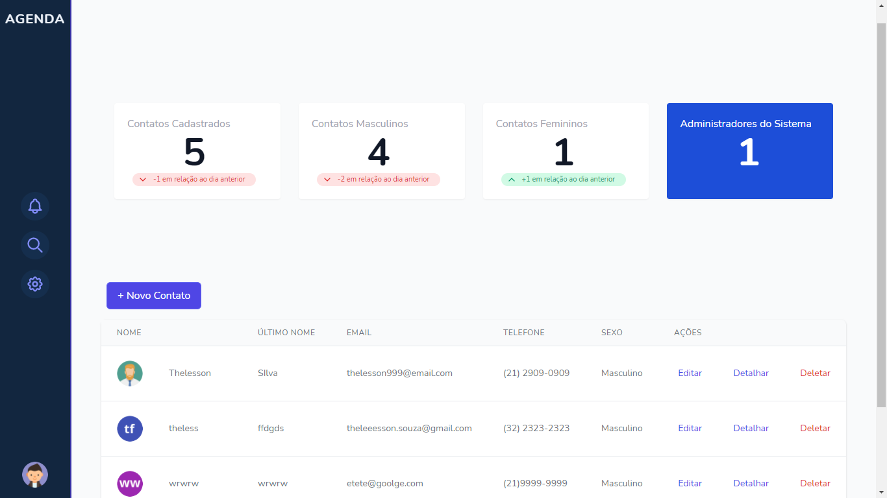
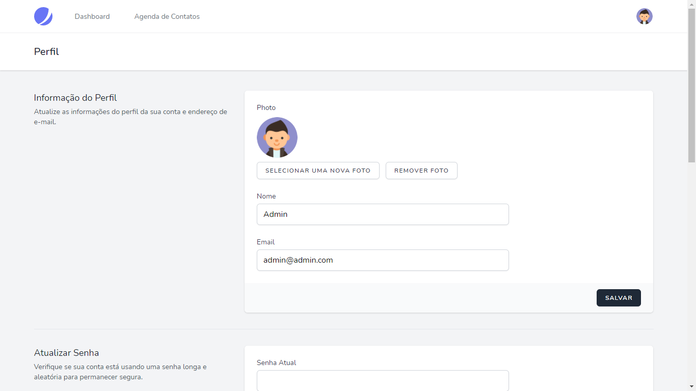

## Laravel - Tailwind - Agenda de Contatos Simples 

Protótipo de uma aplicação Laravel que realiza um crud básico para cadastro de contatos.
Pilha Laravel + JetStream + Tailwind.

  

- [Veja a Demonstração](https://contato.algoritmo9.site).
- login: admin.admin.com
- senha: admin999

## Instalação

 - Clone para o seu servidor
 - Insira suas credenciais no arquivo .env
 - Realize o migrate utilizando o comando: php artisan migrate ou importe o arquivo base_contato.sql caso para a sua base de dados recém criada, caso queira utilizar o Voyager Laravel. 
 - Certifique-se que possui acesso para escrita na pasta /storage
 - Execute os comandos: sudo npm install e sudo npm run dev  para compilar os arquivos frontend
 - Em alguns casos pode ser necessário regenerar o link storage na pasta pública. Delete a pasta /storage localizado em /public e rode o comando: php artisan storage:link

##  Funcionalidades

 - Realizar o crud básico de contatos. 
 - Realizar buscas de contatos por nome, ultimo nome, telefone ou email, utlizando o Livewire.

## Algumas capturas de tela

  

  

  

  

  

  

  

  

  

## 2021

